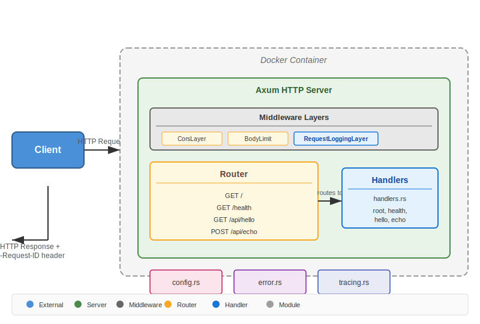

# Hello Rust

An HTTP server built in Rust using the Axum framework.

## Project Overview

- **Project name**: hello-rust
- **Type**: HTTP Server
- **Edition**: 2021
- **Framework**: Axum 0.8
- **Key Dependencies**: axum, tokio, tower-http, clap

## Architecture



## Build / Run

### Build
```bash
cargo build        # Build debug mode
cargo build --release  # Build release mode
cargo run          # Build and run (starts HTTP server)
```

### Linting
```bash
cargo fmt          # Format code (run before committing)
cargo fmt --check # Check formatting without modifying
cargo clippy       # Run lints and warnings
cargo clippy -- -D warnings  # Treat warnings as errors
```

### Testing
```bash
cargo test              # Run all tests
cargo test <test_name>   # Run a single test (partial name match)
cargo test -- --nocapture    # Show print output during tests
```

#### Available Tests
| Test | Description |
|------|-------------|
| `test_root` | GET / returns HTML with Ferris ASCII art |
| `test_health` | GET /health returns 200 OK |
| `test_hello` | GET /api/hello returns JSON response |
| `test_echo` | POST /api/echo echoes JSON body |
| `test_not_found` | Unknown routes return 404 |

### Additional
```bash
cargo check     # Type-check without building
cargo doc        # Build documentation
cargo doc --open # Build and open documentation
```

## Server Configuration

Configuration precedence: **CLI args > Environment Variables > Defaults**

### Command Line Arguments
| Argument | Env Variable | Default | Description |
|----------|--------------|---------|-------------|
| `--http-port` | `HTTP_PORT` | `8080` | HTTP server port |
| `--log-level` | `RUST_LOG` | `info` | Logging level |

### Examples
```bash
# Using defaults
cargo run

# Using CLI arguments
cargo run -- --http-port 3000

# Using environment variables
HTTP_PORT=3000 cargo run
```

## REST API Endpoints

| Method | Path | Description |
|--------|------|-------------|
| GET | `/` | Hello from Ferris |
| GET | `/health` | Health check (200 OK) |
| GET | `/api/hello` | JSON response |
| POST | `/api/echo` | Echo JSON body |

## Docker

### Build
```bash
docker build -t hello-rust .
```

### Run
```bash
docker run -p 8080:8080 hello-rust
```

## Project Structure
```
src/
├── main.rs           # Entry point, server setup
├── config.rs         # CLI args & configuration
└── web/
    ├── mod.rs        # Module exports
    ├── router.rs     # Route definitions
    ├── handlers.rs   # HTTP handlers
    └── error.rs      # Error types
```
